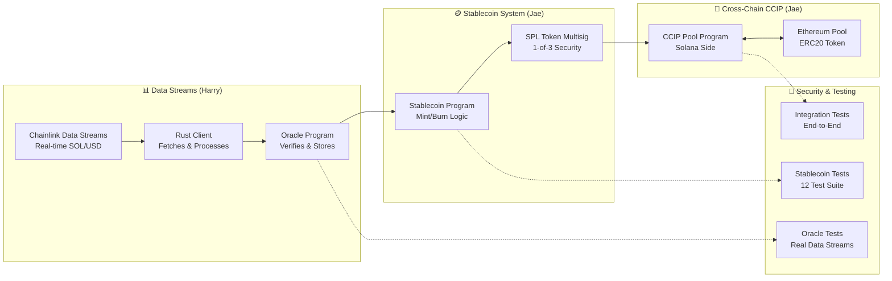

# Chainlink Data Streams Oracle-Backed Cross-Chain Stablecoin Workshop

## 🎯 Overview

This repository contains a **complete workshop implementation** of an **oracle-backed stablecoin system** that integrates **Chainlink Data Streams** for real-time price feeds and **Chainlink CCIP** for cross-chain functionality on Solana and Ethereum.

**Built on Official Chainlink Tools:**
- **[Chainlink Data Streams SDK](https://docs.chain.link/data-streams)** - Official SDK for real-time price feed integration
- **[Chainlink Solana CCIP Starter Kit](https://github.com/smartcontractkit/ccip-solana-starter-kit)** - Official starter kit for cross-chain functionality

### Workshop Content
- **Real-time price integration** via Chainlink Data Streams SDK
- **Oracle program** for on-chain price verification and storage
- **Stablecoin program** with collateral management and minting logic
- **Cross-chain transfers** using Chainlink CCIP
- **Multisig security** with SPL Token multisig integration
- **Production-ready testing** with comprehensive test suites

### Workshop Instructors
- **Harry** - Chainlink Data Streams and Oracle Program implementation
- **Jae** - Stablecoin integration with Oracle Program and Cross-Chain CCIP configuration

## 📁 Project Structure

```
example_verify/
├── README.md                    # This overview and instructions
├── INSTRUCTIONS.md              # Complete step-by-step deployment guide
├── oracle/                      # Chainlink Data Streams & Oracle Program
│   ├── README.md               # Oracle system documentation
│   ├── programs/oracle/        # Solana oracle program
│   ├── client/                 # Rust client for Data Streams integration
│   └── tests/                  # Oracle program tests
└── cross-chain-stablecoin/     # Stablecoin & CCIP Integration
    └── stablecoin-program/     # Main stablecoin implementation
        ├── README.md           # Stablecoin system documentation
        ├── programs/           # Solana stablecoin program
        ├── tests/              # Comprehensive test suite (12 tests)
        └── scripts/            # Deployment and utility scripts
```

## 🏗️ System Architecture



## 🛠️ Built With

This workshop leverages key Chainlink development tools:

### Core Dependencies
- **[Chainlink Data Streams SDK](https://docs.chain.link/data-streams)** - Real-time price feed integration
- **[Chainlink Data Streams Report](https://crates.io/crates/chainlink-data-streams-report)** - Report decoding and verification
- **[CCIP Solana Starter Kit](https://github.com/smartcontractkit/ccip-solana-starter-kit)** - Cross-chain functionality
- **[Anchor Framework](https://www.anchor-lang.com/)** - Solana program development
- **[SPL Token Program](https://spl.solana.com/token)** - Token and multisig management

### Development Tools
- **Solana CLI** - Blockchain interaction and deployment
- **Rust** - Oracle client and program development
- **TypeScript** - Testing and deployment scripts
- **Hardhat** - Ethereum smart contract deployment

## 🚀 Quick Start

### Prerequisites
```bash
# Required software
Solana CLI >= 1.17.0
Anchor >= 0.31.1
Node.js >= 16.0.0
Rust >= 1.70.0
```

### Setup & Deployment
```bash
# 1. Configure Solana
solana config set --url devnet
solana-keygen new
solana airdrop 2

# 2. Follow complete deployment guide
# See INSTRUCTIONS.md for detailed step-by-step process
```

## 📋 Complete Deployment Instructions

**👉 See [INSTRUCTIONS.md](./INSTRUCTIONS.md) for the complete step-by-step deployment guide**

The instructions cover:
- **Phase 1:** Oracle Program Deployment (Data Streams integration)
- **Phase 2:** Stablecoin Program Deployment (Oracle integration)
- **Phase 3:** CCIP Pool Setup (Cross-chain configuration)
- **Phase 4:** Ethereum Side Deployment (ERC20 token and pool)
- **Phase 5:** Cross-Chain Configuration (Solana ↔ Ethereum)
- **Phase 6:** Testing and Token Operations (End-to-end validation)
- **Phase 7:** Cross-Chain Transfer Execution (Live transfers)

## 🧪 Testing

### Comprehensive Test Suites

Each component includes thorough testing:

#### Oracle Tests (`oracle/tests/`)
```bash
cd oracle
anchor test  # Real Chainlink Data Streams integration
```

#### Stablecoin Tests (`cross-chain-stablecoin/stablecoin-program/tests/`)
```bash
cd cross-chain-stablecoin/stablecoin-program
./test-individual.sh all  # 12 comprehensive tests

# Individual test categories
./test-individual.sh oracle      # Oracle integration (3 tests)
./test-individual.sh stablecoin  # Program logic (4 tests)
./test-individual.sh integration # End-to-end (4 tests)
./test-individual.sh ccip        # CCIP multisig (1 test)
```

### Test Coverage
- ✅ **Real Chainlink Data Integration** - Live SOL/USD price feeds
- ✅ **Oracle Program Verification** - On-chain price storage and retrieval
- ✅ **Stablecoin Minting/Burning** - Complete collateral management
- ✅ **Cross-Program Invocation** - Oracle ↔ Stablecoin integration
- ✅ **Multisig Authority** - SPL Token multisig operations
- ✅ **CCIP Cross-Chain** - Solana ↔ Ethereum transfers

## 🎯 Workshop Learning Objectives

### Part 1: Chainlink Data Streams & Oracle (Harry)
- Integrate real-time price feeds using Chainlink Data Streams SDK
- Build Rust client for fetching and processing price reports
- Implement Solana oracle program for on-chain price verification
- Handle report compression, validation, and storage

### Part 2: Stablecoin & Cross-Chain Integration (Jae)
- Build oracle-backed stablecoin with collateral management
- Implement Cross-Program Invocation (CPI) between programs
- Configure SPL Token multisig for enhanced security
- Set up CCIP for cross-chain token transfers
- Deploy and configure Ethereum side components

## Workshop Setup Guide

**Ready to build?** Follow the complete step-by-step deployment guide:

**[→ INSTRUCTIONS.md](./INSTRUCTIONS.md)** - Complete deployment walkthrough

If you encounter any issues during the workshop, check the troubleshooting section below.

## 📚 Documentation

Each component includes comprehensive documentation:

- **[Oracle System](./oracle/README.md)** - Complete Data Streams and Oracle documentation
- **[Stablecoin System](./cross-chain-stablecoin/stablecoin-program/README.md)** - Stablecoin and CCIP integration guide

## 🎉 Workshop Outcomes

By completing this workshop, you will have:

✅ **Built a datastreams-backed stablecoin system**  
✅ **Implemented secure multisig authority management**  
✅ **Configured cross-chain transfers via CCIP**  
✅ **Deployed to both Solana and Ethereum networks**  

## 🔗 Resources

- [Chainlink Data Streams Documentation](https://docs.chain.link/data-streams)
- [CCIP Documentation](https://docs.chain.link/ccip)
- [Solana Program Development](https://docs.solana.com/developing/programming-model/overview)
- [Anchor Framework](https://www.anchor-lang.com/)

## Troubleshooting

### Common Issues and Solutions

#### 1. "AccountNotInitialized" Error During CCIP Transfer
**Solution:** Create pool token account
```bash
spl-token create-account $SOL_TOKEN_MINT \
  --owner $SOL_POOL_SIGNER_PDA \
  --fee-payer ~/.config/solana/id.json
```

#### 2. "owner does not match" Error During Transfer
**Solution:** Delegate token authority to CCIP
```bash
npm run svm:token:delegate -- --token-mint $SOL_TOKEN_MINT
```

#### 3. Oracle Price Feed Not Found
**Solution:** Update oracle with fresh data
```bash
cd ../oracle/client
cargo run -- update-oracle
```

#### 4. Multisig Minting Issues
**Solution:** Ensure you're using the correct multisig command
```bash
spl-token mint $SOL_TOKEN_MINT [amount] \
  --owner $SOL_MULTISIG_ADDRESS \
  --multisig-signer ~/.config/solana/id.json
```

#### 5. Cross-Chain Transfer Issues

**Problem A:** Transfer shows hardcoded fallback address instead of your intended receiver
**Solution:** Use `--receiver-address` instead of `--destination-address`
```bash
# Wrong - uses hardcoded fallback address
npm run svm:token-transfer -- --destination-address $ETH_RECEIVER_ADDRESS

# Correct - uses your specified address  
npm run svm:token-transfer -- --receiver-address $ETH_RECEIVER_ADDRESS
```

**Problem B:** Transfer uses default amount (10000000) instead of your specified amount
**Solution:** Use `--token-amount` instead of `--amount`
```bash
# Wrong - parameter ignored, uses default amount
npm run svm:token-transfer -- --amount 18000000

# Correct - uses your specified amount
npm run svm:token-transfer -- --token-amount 18000000
```

#### 6. Oracle Testing Issues

**Problem:** `anchor test` fails with deployment errors or environment variable issues
**Root Cause:** The oracle program is already deployed, but `anchor test` tries to redeploy it

**Solutions:**

**A. Environment Variable Loading Issues:**
```bash
# If you see "ANCHOR_PROVIDER_URL is not defined"
# This is usually fixed by the .env symlinks, but if needed:
cd ../cross-chain-stablecoin/stablecoin-program

# Verify .env symlinks exist
ls -la .env .env.example

# If missing, recreate symlinks
ln -sf ../../.env .env
ln -sf ../../.env.example .env.example

# Use the recommended test script instead of direct ts-mocha
./test-individual.sh oracle
```

**B. .env File Parsing Errors:**
```bash
# If you see "parse error near '&'" or similar
# Check for unquoted special characters in DATASTREAMS_CLIENT_SECRET
vim .env
# Find DATASTREAMS_CLIENT_SECRET= and make sure the value is quoted:
# DATASTREAMS_CLIENT_SECRET="your-secret-with-special&characters<here>"
```

**C. Oracle Program ID Mismatch:**
```bash
# If you see "AccountOwnedByWrongProgram" or "ConstraintAddress" errors
# This usually means Step 2.3 was skipped or failed
# Re-run the oracle program update step:
cd ../cross-chain-stablecoin/stablecoin-program
source .env

# Update stablecoin program source code
cd programs/stablecoin-program/src/
sed -i '' "s/pubkey!(\"[^\"]*\")/pubkey!(\"$ORACLE_PROGRAM_ID\")/" lib.rs

# Rebuild and redeploy
cd ../../..
anchor build && anchor deploy --provider.cluster devnet
```

**D. Recommended Testing Method:**
```bash
# Use the test-individual.sh script (recommended)
cd ../cross-chain-stablecoin/stablecoin-program
./test-individual.sh oracle      # Oracle integration tests
./test-individual.sh stablecoin  # Program logic tests  
./test-individual.sh integration # Complete CPI tests
./test-individual.sh all         # All tests together

# Alternative: Test oracle client directly (from stablecoin-program directory)
cd ../../oracle/client
cargo run -- update-oracle
```

**E. Deployment Account Issues:**
If you see `AccountNotFound` errors during testing, the oracle program is likely already deployed and working. Verify with:
```bash
source .env
solana program show $ORACLE_PROGRAM_ID
```

